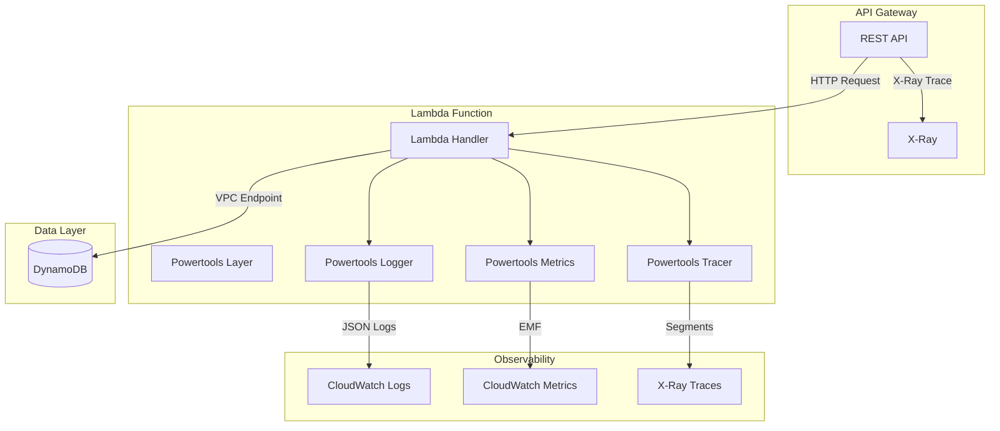

# Design Document: Serverless Observability

## Overview

This design document describes the technical implementation for adding comprehensive observability to the existing AWS serverless application. The solution leverages AWS Lambda Powertools for Python to provide structured logging, custom metrics, and X-Ray tracing with minimal code changes while maintaining backward compatibility.

The implementation follows a decorator-based approach using Lambda Powertools, which provides:
- Structured JSON logging with automatic correlation ID injection
- CloudWatch Embedded Metric Format (EMF) for custom metrics
- X-Ray tracing with automatic instrumentation and custom subsegments

## Architecture



### Request Flow with Observability

1. API Gateway receives request and starts X-Ray trace
2. Lambda function invoked with trace context propagated
3. Powertools Logger logs request with correlation ID (request_id + trace_id)
4. Powertools Tracer creates subsegments for DynamoDB operations
5. Powertools Metrics captures latency and success/error counts
6. Response returned with all telemetry data emitted

## Components and Interfaces

### Lambda Handler Module (`lambda/apigw-handler/index.py`)

The handler module will be refactored to use Powertools decorators and implement routing for the health endpoint.

```python
from aws_lambda_powertools import Logger, Metrics, Tracer
from aws_lambda_powertools.metrics import MetricUnit
from aws_lambda_powertools.utilities.typing import LambdaContext
from typing import Any

# Initialize Powertools components
logger = Logger(service="serverless-api")
metrics = Metrics(namespace="ServerlessApp", service="serverless-api")
tracer = Tracer(service="serverless-api")

@logger.inject_lambda_context(log_event=True)
@metrics.log_metrics(capture_cold_start_metric=True)
@tracer.capture_lambda_handler
def handler(event: dict[str, Any], context: LambdaContext) -> dict[str, Any]:
    """Main Lambda handler with observability instrumentation."""
    pass

@tracer.capture_method
def handle_post_request(event: dict[str, Any]) -> dict[str, Any]:
    """Handle POST requests to write data to DynamoDB."""
    pass

@tracer.capture_method
def handle_health_check() -> dict[str, Any]:
    """Handle GET /health requests."""
    pass

@tracer.capture_method
def write_to_dynamodb(item: dict[str, Any]) -> None:
    """Write item to DynamoDB with tracing."""
    pass

def check_dynamodb_health() -> tuple[bool, float, str | None]:
    """Check DynamoDB connectivity and return health status."""
    pass
```

### CDK Stack Updates (`stacks/apigw_http_api_lambda_dynamodb_python_cdk_stack.py`)

The CDK stack will be updated to:
- Add Lambda Powertools layer
- Enable X-Ray tracing on Lambda and API Gateway
- Configure environment variables for Powertools
- Add /health endpoint route

```python
from aws_cdk import (
    aws_lambda as lambda_,
    aws_apigateway as apigw_,
)

# Lambda Powertools Layer ARN (region-specific)
powertools_layer = lambda_.LayerVersion.from_layer_version_arn(
    self, "PowertoolsLayer",
    layer_version_arn=f"arn:aws:lambda:{self.region}:017000801446:layer:AWSLambdaPowertoolsPythonV3-python310-x86_64:7"
)

# Lambda with X-Ray tracing
api_handler = lambda_.Function(
    self, "ApiHandler",
    tracing=lambda_.Tracing.ACTIVE,
    layers=[powertools_layer],
    environment={
        "POWERTOOLS_SERVICE_NAME": "serverless-api",
        "POWERTOOLS_METRICS_NAMESPACE": "ServerlessApp",
        "LOG_LEVEL": "INFO",
    },
    # ... existing config
)

# API Gateway with X-Ray tracing
api = apigw_.LambdaRestApi(
    self, "Endpoint",
    handler=api_handler,
    deploy_options=apigw_.StageOptions(
        tracing_enabled=True,
    ),
)

# Health endpoint
health_resource = api.root.add_resource("health")
health_resource.add_method("GET")
```

### Interfaces

#### Logger Interface

| Method | Parameters | Returns | Description |
|--------|------------|---------|-------------|
| `logger.info()` | message: str, **kwargs | None | Log info level message with structured data |
| `logger.error()` | message: str, **kwargs | None | Log error with stack trace |
| `logger.append_keys()` | **kwargs | None | Add persistent keys to all log entries |

#### Metrics Interface

| Method | Parameters | Returns | Description |
|--------|------------|---------|-------------|
| `metrics.add_metric()` | name: str, unit: MetricUnit, value: float | None | Add metric value |
| `metrics.add_dimension()` | name: str, value: str | None | Add dimension to metrics |

#### Tracer Interface

| Method | Parameters | Returns | Description |
|--------|------------|---------|-------------|
| `@tracer.capture_method` | function | Decorated function | Trace method execution |
| `tracer.put_annotation()` | key: str, value: str | None | Add searchable annotation |
| `tracer.put_metadata()` | key: str, value: Any | None | Add metadata to segment |

## Data Models

### Log Entry Structure

```json
{
    "timestamp": "2024-01-15T10:30:00.000Z",
    "level": "INFO",
    "message": "Processing request",
    "service": "serverless-api",
    "correlation_id": "abc123-def456",
    "xray_trace_id": "1-abc123-def456789",
    "cold_start": false,
    "function_name": "apigw_handler",
    "function_memory_size": 1024,
    "function_arn": "arn:aws:lambda:...",
    "function_request_id": "abc123-def456",
    "extra": {
        "table_name": "demo_table",
        "operation": "put_item"
    }
}
```

### Health Response Structure

```json
{
    "status": "healthy",
    "timestamp": "2024-01-15T10:30:00.000Z",
    "checks": {
        "dynamodb": {
            "status": "healthy",
            "latency_ms": 45.2,
            "table_name": "demo_table"
        }
    },
    "version": "1.0.0"
}
```

### Unhealthy Response Structure

```json
{
    "status": "unhealthy",
    "timestamp": "2024-01-15T10:30:00.000Z",
    "checks": {
        "dynamodb": {
            "status": "unhealthy",
            "error": "Connection timeout",
            "table_name": "demo_table"
        }
    },
    "version": "1.0.0"
}
```

### Metrics Emitted

| Metric Name | Unit | Dimensions | Description |
|-------------|------|------------|-------------|
| `RequestLatency` | Milliseconds | endpoint, method | Total request processing time |
| `DynamoDBLatency` | Milliseconds | operation, table | DynamoDB operation duration |
| `SuccessfulRequests` | Count | endpoint | Successful request count |
| `ClientErrors` | Count | endpoint, status_code | 4xx error count |
| `ServerErrors` | Count | endpoint, status_code | 5xx error count |
| `ColdStart` | Count | function_name | Cold start occurrences |

### API Request/Response Models

#### POST / Request Body

```json
{
    "year": 2024,
    "title": "Movie Title",
    "id": "unique-id"
}
```

#### POST / Response Body

```json
{
    "message": "Successfully inserted data!"
}
```

#### GET /health Response Body

```json
{
    "status": "healthy|unhealthy",
    "timestamp": "ISO8601 timestamp",
    "checks": {
        "dynamodb": {
            "status": "healthy|unhealthy",
            "latency_ms": 45.2,
            "table_name": "demo_table",
            "error": "optional error message"
        }
    },
    "version": "1.0.0"
}
```


## Correctness Properties

*A property is a characteristic or behavior that should hold true across all valid executions of a system—essentially, a formal statement about what the system should do. Properties serve as the bridge between human-readable specifications and machine-verifiable correctness guarantees.*

### Property 1: Log Entry Structure Completeness

*For any* request processed by the Lambda handler, the emitted log entry SHALL contain all required fields: timestamp, level, message, service, and correlation_id.

**Validates: Requirements 1.1**

### Property 2: Correlation ID Consistency

*For any* request with a known AWS request ID, the correlation_id in all log entries for that request SHALL match the AWS request ID from the Lambda context.

**Validates: Requirements 1.2**

### Property 3: X-Ray Trace ID Inclusion

*For any* request processed when X-Ray tracing is active, the log entries SHALL contain the xray_trace_id field matching the active trace ID.

**Validates: Requirements 1.3**

### Property 4: DynamoDB Operation Logging Context

*For any* DynamoDB write operation, the log entry SHALL contain the table_name and operation_type in the contextual information.

**Validates: Requirements 1.4**

### Property 5: Response Logging Completeness

*For any* completed request, the final log entry SHALL contain the response status_code and execution duration_ms.

**Validates: Requirements 1.5**

### Property 6: Error Logging with Stack Trace

*For any* request that results in an error, the error log entry SHALL contain the full stack trace and the correlation_id.

**Validates: Requirements 1.6**

### Property 7: Request Latency Metric Emission

*For any* completed request, a RequestLatency metric SHALL be emitted with the duration in milliseconds and correct dimensions.

**Validates: Requirements 2.1**

### Property 8: Client Error Metric Emission

*For any* request returning a 4xx status code, a ClientErrors metric SHALL be incremented with status_code and endpoint dimensions.

**Validates: Requirements 2.2**

### Property 9: Server Error Metric Emission

*For any* request returning a 5xx status code, a ServerErrors metric SHALL be incremented with status_code and endpoint dimensions.

**Validates: Requirements 2.3**

### Property 10: DynamoDB Latency Metric Emission

*For any* successful DynamoDB write operation, a DynamoDBLatency metric SHALL be emitted with the operation duration.

**Validates: Requirements 2.4**

### Property 11: Success Metric Emission

*For any* request completing with a 2xx status code, a SuccessfulRequests metric SHALL be incremented.

**Validates: Requirements 2.5**

### Property 12: Metrics Namespace Consistency

*For all* metrics emitted by the application, the namespace SHALL be the configured value "ServerlessApp".

**Validates: Requirements 2.6**

### Property 13: DynamoDB Trace Subsegment Creation

*For any* DynamoDB operation, a trace subsegment SHALL be created with the operation name.

**Validates: Requirements 3.3**

### Property 14: Business Logic Trace Subsegments

*For any* traced method execution, a subsegment SHALL be created with a descriptive name matching the method.

**Validates: Requirements 3.4**

### Property 15: Exception Capture in Traces

*For any* error occurring in a traced method, the exception SHALL be captured in the trace segment metadata.

**Validates: Requirements 3.5**

### Property 16: Health Check Duration Inclusion

*For any* health check response (healthy or unhealthy), the response body SHALL contain the latency_ms field with a non-negative value.

**Validates: Requirements 4.5**

### Property 17: POST Request Data Persistence and Response Format

*For any* valid POST request with year, title, and id fields, the Lambda handler SHALL write the data to DynamoDB, return a 200 status code, and include a "message" field in the response body.

**Validates: Requirements 6.1, 6.3**

## Error Handling

### Request Validation Errors

| Error Condition | Status Code | Response | Logging | Metrics |
|-----------------|-------------|----------|---------|---------|
| Invalid JSON body | 400 | `{"message": "Invalid JSON in request body"}` | Error logged with parse error details | ClientErrors incremented |
| Missing required fields | 400 | `{"message": "Missing required field: {field}"}` | Warning logged with missing field | ClientErrors incremented |

### DynamoDB Errors

| Error Condition | Status Code | Response | Logging | Metrics |
|-----------------|-------------|----------|---------|---------|
| Connection timeout | 500 | `{"message": "Database operation failed"}` | Error logged with timeout details | ServerErrors incremented |
| Throttling | 500 | `{"message": "Database operation failed"}` | Error logged with throttle info | ServerErrors incremented |
| Access denied | 500 | `{"message": "Database operation failed"}` | Error logged with permission error | ServerErrors incremented |

### Health Check Errors

| Error Condition | Status Code | Response | Logging |
|-----------------|-------------|----------|---------|
| DynamoDB unreachable | 503 | `{"status": "unhealthy", "checks": {"dynamodb": {"status": "unhealthy", "error": "..."}}}` | Error logged |
| Describe table timeout | 503 | `{"status": "unhealthy", "checks": {"dynamodb": {"status": "unhealthy", "error": "Timeout"}}}` | Error logged |

### Error Response Structure

All error responses follow this structure:

```json
{
    "message": "Human-readable error description",
    "correlation_id": "request-correlation-id"
}
```

For health endpoint errors:

```json
{
    "status": "unhealthy",
    "timestamp": "ISO8601 timestamp",
    "checks": {
        "dynamodb": {
            "status": "unhealthy",
            "error": "Error description",
            "table_name": "demo_table"
        }
    },
    "version": "1.0.0"
}
```

## Testing Strategy

### Dual Testing Approach

This feature requires both unit tests and property-based tests for comprehensive coverage:

- **Unit tests**: Verify specific examples, edge cases, infrastructure configuration, and error conditions
- **Property tests**: Verify universal properties across all valid inputs using randomized testing

### Property-Based Testing Configuration

- **Library**: Hypothesis for Python
- **Minimum iterations**: 100 per property test
- **Tag format**: `Feature: serverless-observability, Property {number}: {property_text}`

### Unit Test Coverage

| Test Category | Test Cases |
|---------------|------------|
| CDK Infrastructure | X-Ray enabled on Lambda, X-Ray enabled on API Gateway, Powertools layer attached, Environment variables configured, /health endpoint exists, IAM permissions for X-Ray |
| Health Endpoint | Returns 200 when DynamoDB healthy, Returns 503 when DynamoDB unhealthy, Response contains required fields, No authentication required |
| POST Endpoint | Handles valid JSON body, Handles missing body with defaults, Returns correct response format |
| Error Handling | Invalid JSON returns 400, Missing fields returns 400, DynamoDB errors return 500 |

### Property Test Coverage

| Property | Test Description | Generator |
|----------|------------------|-----------|
| Property 1 | Log structure completeness | Random valid requests |
| Property 2 | Correlation ID consistency | Random requests with known context |
| Property 3 | X-Ray trace ID inclusion | Random requests with mocked X-Ray context |
| Property 4 | DynamoDB operation logging | Random DynamoDB items |
| Property 5 | Response logging completeness | Random requests completing successfully |
| Property 6 | Error logging with stack trace | Random requests triggering errors |
| Property 7-12 | Metrics emission properties | Random requests with various outcomes |
| Property 13-15 | Tracing properties | Random traced operations |
| Property 16 | Health check duration | Random health check executions |
| Property 17 | POST data persistence | Random valid POST payloads |

### Test File Structure

```
tests/
├── unit/
│   ├── test_cdk_stack.py          # CDK infrastructure tests
│   ├── test_handler.py            # Handler unit tests
│   └── test_health_endpoint.py    # Health endpoint tests
└── property/
    ├── test_logging_properties.py  # Properties 1-6
    ├── test_metrics_properties.py  # Properties 7-12
    ├── test_tracing_properties.py  # Properties 13-15
    └── test_handler_properties.py  # Properties 16-17
```

### Mocking Strategy

- **DynamoDB**: Use moto library for DynamoDB mocking
- **X-Ray**: Mock aws_xray_sdk context for tracing tests
- **Powertools**: Use Powertools testing utilities for metrics and logging capture
- **Lambda Context**: Create mock LambdaContext objects with known request IDs
